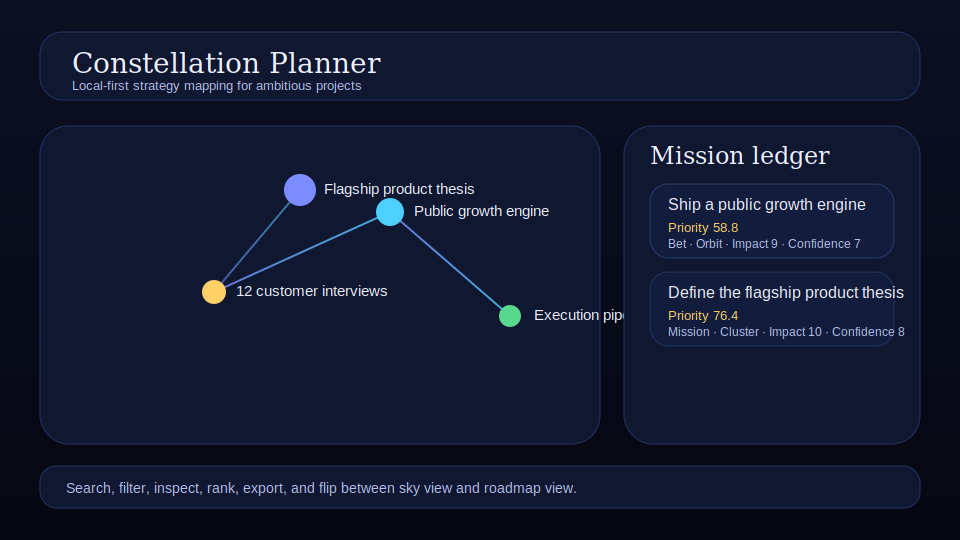

# Constellation Planner

A local-first strategy map where projects become stars and dependencies become visible paths.



Constellation Planner is for founders, operators, and solo builders who want more than a flat task list. Plot your bets on a living star map, connect dependencies as glowing routes, inspect each initiative in place, and see which ideas carry the strongest strategic pull.

## Features

- **Interactive sky map** with draggable-feeling star placement and glowing dependency routes
- **Four star types**: mission, bet, experiment, and ops
- **Four execution stages**: spark, orbit, cluster, and launch
- **Inspector drawer** for editing title, note, kind, status, and leverage signals
- **Priority scoring** using impact, confidence, and effort
- **Mission ledger** with ranked stars beside the map
- **Search and filters** for narrowing the visible constellation
- **Insight cards** for top priority, fastest win, and execution anchor
- **Roadmap mode** for seeing the same strategy as stage-based lanes
- **Import/export JSON backups** so the data stays yours
- **Keyboard shortcuts** and toast feedback for speed
- **Local-first persistence** via `localStorage`

## Quick start

```bash
git clone https://github.com/<you>/constellation-planner.git
cd constellation-planner
python -m http.server 8000
```

Then open <http://localhost:8000>.

You can also open `index.html` directly in a modern browser. There is no build step.

## Shortcuts

- `N` add a new star
- `E` export the current constellation
- `/` focus the search box

## Data model

Constellation Planner stores plain JSON in the browser:

```json
{
  "mapTitle": "Founder operating system",
  "stars": [
    {
      "id": "star_bet_growth",
      "title": "Ship a public growth engine",
      "kind": "bet",
      "status": "orbit",
      "impact": 9,
      "confidence": 7,
      "effort": 7,
      "x": 70,
      "y": 44
    }
  ],
  "links": [
    {
      "id": "link_2",
      "from": "star_mission_core",
      "to": "star_bet_growth",
      "label": "guides"
    }
  ]
}
```

## Project structure

```text
constellation-planner/
  index.html
  styles/
    tokens.css
    app.css
    sky.css
    list.css
    controls.css
    insights.css
    roadmap.css
  js/
    main.js
    model.js
    store.js
    seeds.js
    sky.js
    roadmap.js
    io.js
    feedback.js
    shortcuts.js
  docs/
    preview.svg
```

## Privacy

Everything stays in your browser unless you explicitly export a backup. Constellation Planner never makes a network request.

## License

MIT
